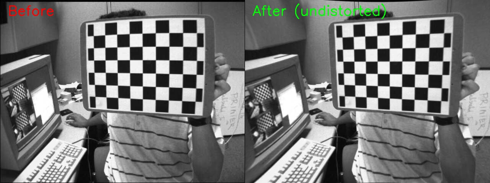
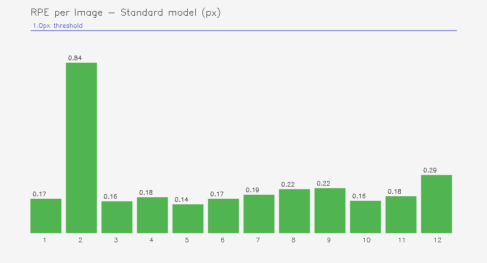
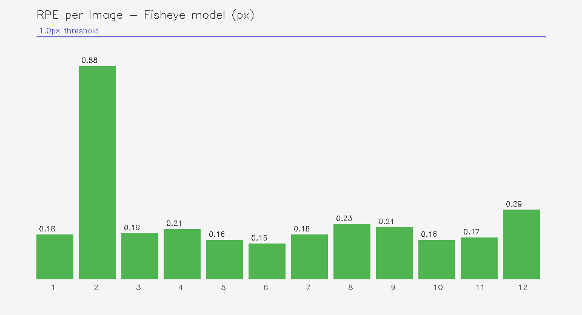

# Camera Intrinsic Calibration Tool (C++ / OpenCV)

A command-line tool that computes camera intrinsic parameters and distortion
coefficients from chessboard images. Supports both **standard** and
**fisheye** camera models.

## Results

| Model | RPE | k1 (distortion) |
|-------|-----|-----------------|
| Standard | **0.42 px** | -0.266 (barrel) |
| Fisheye  | **0.43 px** | equidistant projection |

Both models stay well below the 1.0 px quality threshold.
Standard model fits better for this dataset (non-fisheye lens).

### Before / After undistortion


### RPE per image — Standard model


### RPE per image — Fisheye model


## Usage
```bash
./calibrate              # standard model (default)
./calibrate --fisheye    # fisheye model (AVM cameras)
```

## Pipeline
```
Chessboard images
      │
      ▼
findChessboardCorners()
cornerSubPix()            ← sub-pixel accuracy
      │
      ▼
calibrateCamera()         ← standard: polynomial distortion
fisheye::calibrate()      ← fisheye: equidistant projection
      │
      ▼
projectPoints()           ← compute per-image RPE
RPE bar chart             ← visualize quality per image
      │
      ▼
calib_result.yaml         ← K matrix + distortion coeffs
comparison.jpg            ← before / after undistort
```

## Build & Run
```bash
sudo apt install build-essential cmake libopencv-dev

git clone https://github.com/jeason522/camera-calibration.git
cd camera-calibration
mkdir build && cd build
cmake ..
make
./calibrate
```

## Output files

| File | Description |
|------|-------------|
| `calib_result.yaml` | Camera matrix K and distortion coefficients |
| `comparison.jpg` | Before / after undistortion |
| `rpe_per_image.png` | Per-image RPE — standard model |
| `rpe_fisheye.png` | Per-image RPE — fisheye model |

## Environment

- Language: C++17
- Library: OpenCV 4.6.0
- Build system: CMake
- Platform: Linux (WSL2 / Ubuntu 22.04)